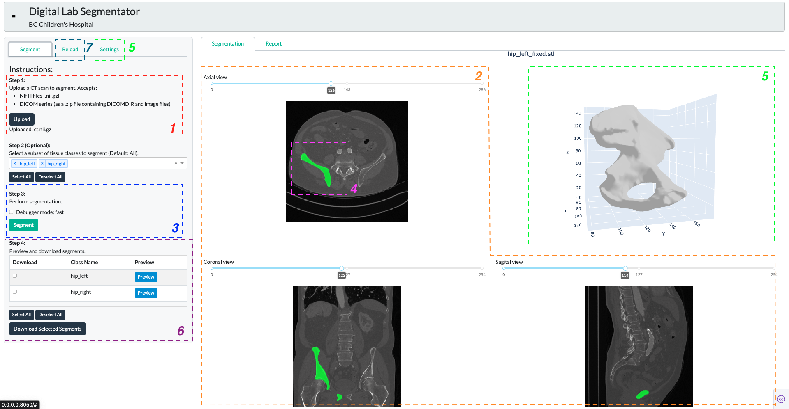
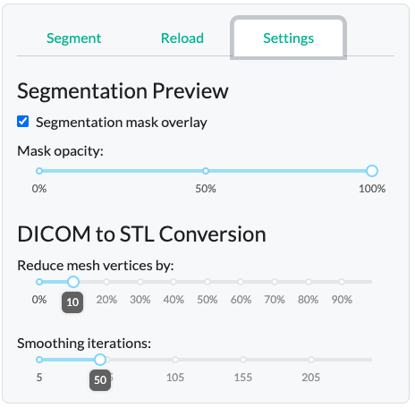

## Produc Overview
Automated medical image segmentation dashboard - designed to integrate seamlessly into a clinical engineer’s workflow for performing and evaluating semantic bone segmentations. The dashboard includes intuitive interface for the following components:

1. Uploading volumetric CT scans 
2. Previewing 2D slices in medical standard “3-pane” view 
3. Running AI segmentation model inference
4. Checking quality of segmentation via mask overlay
5. Reconstructing 3D STL object
6. Downloading desired segments with reporting and dashboard state metadata
7. Reproducing results by re-uploading past segmentations  

One of the key strengths of our products is its ease of use and modularity. The dashboard leverages Dash’s capabilities for web deployment, either locally or on the cloud, and provides intuitive usability without requiring Python proficiency. The modular design on frontend and backend allows for future updates to the segmentation pipeline, permitting an easy integration of other open-source or in-house AI models. Overall, our product supports long-term maintenance, reduces operational cost and case turnaround times.

However, the dashboard does have limitations compared to the existing platforms like 3D Slicer. Main limitations come from the lack of built-in annotation features, measurement tools, and volumetric analysis functions. Furthermore, the quality of segmentation is entirely dependent on the performance of the AI model, with no interface to adjust inference parameters. While the TotalSegmentation shows 0.94 DICE score for adults, inference on the pediatric bones could be less precise. Manual corrections or enhancements therefore are needed, and will need to be done externally outside of our product’s interface. While adding annotation and volumetric analysis features is feasible in future iterations, incorporating 3D STL reconstruction from annotated regions may present challenges due to limitations in the Plotly rendering architecture, particularly in preserving mesh integrity and resolution during dynamic interactions.

## Design Considerations
A central design choice was the adoption of a 4-pane layout that mirrors the standard way of viewing medical images. Three of the panes (bottom left, bottom right, and top right) display 2D slices in axial, coronal, and sagittal views, while the top left pane shows the reconstructed 3D object. To maximize workspace, the instruction panel on the left is collapsible via a hamburger button (top left), allowing the 4-pane view to occupy the full screen, aiding a more focused clinical review.

Another design consideration was to include restriction of viewing segmentation overlays (in green) for one bone class at a time, in order to prevent visual clutter, and maximize interpretability of the segmentation quality on a per-bone basis. The overlay opacity is controlled by a slider in the “Settings” tab. The “Reduce mesh by” parameter controls the resolution complexity of the 3D figure, reducing the number of faces, which is useful for minimizing file size or preparing the mesh for rapid prototyping. The “Smooth surface” parameter enables control over the interpolation of voxel boundaries, allowing for smoother and more anatomically realistic surfaces.

Since generation of the 3D STL output is a bit of a manual process - the engineers must decide how to “connect” individual voxels in the 3D space by a mesh - we included two key adjustable parameters, also found in the “Settings tab”.

Reproducibility was another critical design element for clinical context usability. Therefore, we added a separate “Reload” tab to allow users to reload past segmentation results, reinstating the dashboard, thus enabling result validation and creating an audit trail. The “Reload” tab mirrors the main “Segment” tab layout, reinforcing interface consistency.

## Attributions
* This Project was in partnership with BC Children's Hospital Digital Lab.
* Data: Wasserthal, J., Breit, H.-C., Meyer, M.T., Pradella, M., Hinck, D., Sauter, A.W., Heye, T., Boll, D., Cyriac, J., Yang, S., Bach, M., Segeroth, M., 2023.
TotalSegmentator: Robust Segmentation of 104 Anatomic Structures in CT Images. Radiology: Artificial Intelligence.
https://doi.org/10.1148/ryai.230024

