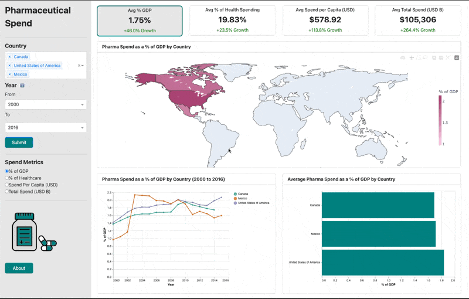

## About
We created an intuitive tool to help healthcare policy administrators across the world to make knowlegeable decisions around drug price policies. This dashboard takes in the scattered worldwide information and presents it as a decision-ready intelligence for daily decision-making. 

This project is based on [Kaggle Pharmaceutical Drug Spending by countries](https://www.kaggle.com/datasets/tunguz/pharmaceutical-drug-spending-by-countries/data) data set, which originated from Organisation for Economic Co-operation and Development (OECD) collected data. With the data capped at 2016, this dashboard architechture can be easily integrated into a new data set.

## Dashboard Overview
Pharmaceutical Spending Dashboard is hosted on the Render platform, and can be accessed [here](https://dsci-532-2025-17-pharma-spend-dashboard.onrender.com/) 

### Components
- Choropleth Map (Top): Displays geographic distribution of spending.
- Time Series Chart (Bottom Left): Shows spending trends over time.
- Bar Graph (Bottom Right): Breaks down overall spending by countries.
- Summary statistics

### Interactions
The user can customize the view of the dashboard by interacting with:
- Global filters: Country and year selectors apply to all charts and summary statistics, keeping the dashboard focused on the selected region and time period.
- Local filters: Radio buttons allow users to choose the specific spending metric they want to explore, which will apply to all charts.
- All charts have tooltips to provide additional information about the data, which will be displayed upon hovering over the chart element of interest.

### Demo

## Contributors
Jason Lee, Celine Habashy, Daria Khon, Catherine Meng
